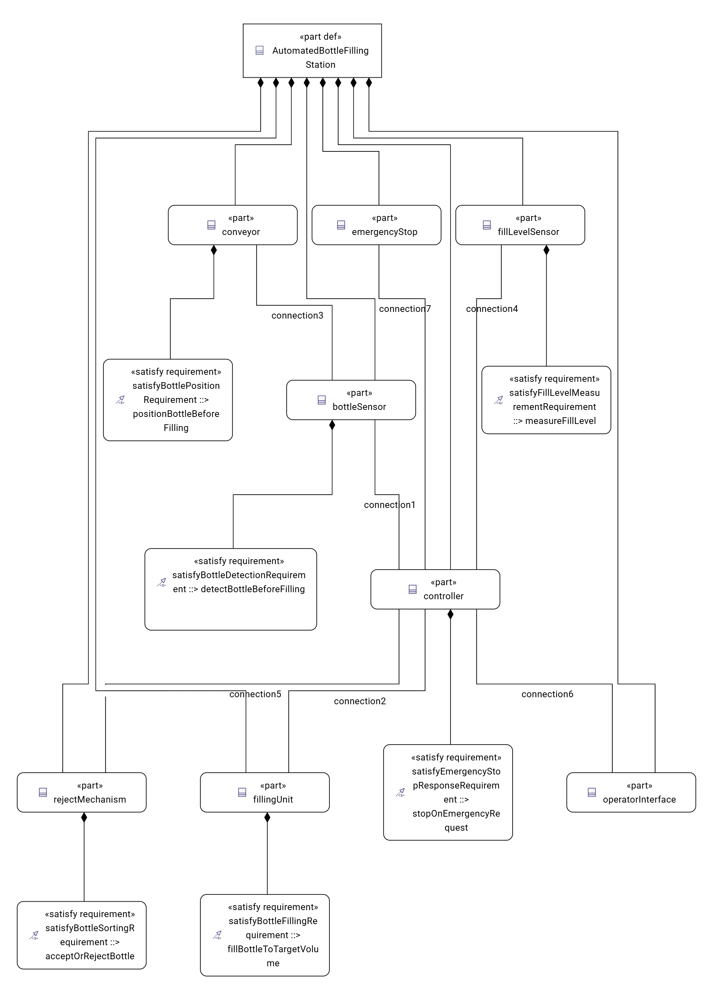

# Automated Bottle Filling Station — SysML v2 / MBSE Mini Project

A small Model-Based Systems Engineering (MBSE) learning project that models a simplified automated bottle-filling station in **SysML v2** using **Eclipse SysON**.

The project connects system requirements, structure, operational behaviour, traceability, and a lightweight Python consistency check in one coherent, conceptual model.

> This is a learning project. It is not a representation of a Krones machine and is not intended for industrial production, safety certification, or physical implementation.

## Objective

Model a station that can receive and detect a bottle, position it, fill it, measure its fill level, accept or reject it, report status, and respond to an emergency-stop request.

## Model contents

### System structure

The model contains these parts:

- `conveyor`
- `bottleSensor`
- `fillingUnit`
- `fillLevelSensor`
- `rejectMechanism`
- `controller`
- `operatorInterface`
- `emergencyStop`

### Operational behaviour

The normal processing flow is:

```text
receiveBottle → detectBottle → positionBottle → fillBottle → measureFillLevel
                                                        ├→ acceptBottle → reportStatus
                                                        └→ rejectBottle → reportStatus
```

### Requirements and traceability

| ID | Requirement | Primary satisfying component | Verification method |
| --- | --- | --- | --- |
| R-001 | Detect a bottle before filling. | `bottleSensor` | Model inspection |
| R-002 | Position a detected bottle before filling. | `conveyor` | Model inspection |
| R-003 | Fill to 500 mL ±5 mL. | `fillingUnit` | Conceptual analysis |
| R-004 | Measure the fill level after filling. | `fillLevelSensor` | Model inspection |
| R-005 | Accept bottles within tolerance and reject bottles outside it. | `rejectMechanism` | Logic analysis |
| R-006 | Stop conveyor and filling within one second of an emergency-stop request. | `controller` | Timing analysis |

The numerical fill and timing values are learning assumptions, not industrial specifications.

## Model diagrams

The system structure is shown below:



Additional exported diagrams are available in the [diagrams/](diagrams/) folder:

- [component-interconnections.png](diagrams/component-interconnections.png) — component connections and named links.
- [operational-behaviour.png](diagrams/operational-behaviour.png) — bottle-processing action flow.
- [requirements-table.png](diagrams/requirements-table.png) — the six SysML requirements.

## Project structure

```text
model/                       Exported SysON project
diagrams/                    PNG exports of the SysON model views
syson/docker-compose.yml     Local SysON setup
data/requirements.csv        Requirements table exported from SysON
data/traceability.csv        Requirement-to-component-to-verification data
src/validate_traceability.py Python consistency validator
tests/                       Automated validator tests
```

## Run the validator

Create and activate a virtual environment, then install the development dependency:

```powershell
python -m venv .venv
.\.venv\Scripts\Activate.ps1
python -m pip install -r requirements-dev.txt
```

Run the traceability validator:

```powershell
python src/validate_traceability.py
```

Run the tests:

```powershell
python -m pytest
```

The validator checks that the traceability data has complete fields, unique requirement IDs, and the expected six requirements.

The SysON requirements table was exported as `data/requirements.csv`. The separate `data/traceability.csv` file records the project’s requirement-to-component-to-verification mapping used by the Python validator.

## Scope and limitations

Included: conceptual requirements, system structure, operational behaviour, requirement traceability, and verification planning.

Excluded: mechanical dimensions, electrical circuits, PLC implementation, fluid simulation, hardware construction, factory integration, and industrial safety certification.

The Python validator checks the exported traceability CSV; it does **not** parse or validate the SysON model ZIP directly. The SysON model was reviewed manually in the modelling environment.

## Tools

- Eclipse SysON
- SysML v2
- Docker Compose
- Python
- pytest
